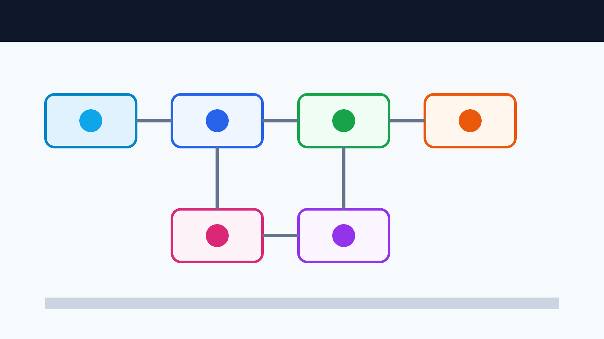

# Extend Sapat Providers in Daytona

# Introduction

Sapat is a Python command-line tool for turning video files into transcripts. It
converts video to a provider-friendly audio format with FFmpeg, sends the audio
to a selected transcription provider, and writes a same-name `.txt` file next to
the source video. Current Sapat uses a provider registry under
`sapat/providers/` and a dynamic `--provider` CLI option, so new integrations
should fit the registry instead of hard-coding another command-line choice.

That makes Sapat a useful small project for AI engineers who want to learn how a
provider adapter should be added, tested, and documented. This guide shows a
repeatable Daytona workflow for adding another provider without turning the
change into guesswork. The concrete example is an AssemblyAI provider, but the
same checklist works for Deepgram, Speechmatics, or any service that accepts
uploaded audio and returns a transcript.



## TL;DR

- Create a Daytona workspace from the Sapat repository so the same branch can be
  tested from a clean environment.
- Map the current provider contract before writing code: registry entry,
  environment variables, upload/transcribe behavior, correction behavior, and
  output file.
- Add the provider as a small [transcription provider adapter](../definitions/20260511_definition_transcription_provider_adapter.md),
  then prove it with mocked tests and a CLI smoke check.
- Package the change with exact code references, commands, and failure-mode
  notes so maintainers can review the provider without reconstructing your
  workspace.

## Prerequisites

You need:

- A GitHub account and a fork of `nkkko/sapat`.
- Daytona installed and authenticated.
- Python 3.10 or later for local validation.
- FFmpeg available in the workspace.
- API credentials for the provider you want to test live.

The live provider call is optional while developing. You can validate most of
the adapter contract with mocked HTTP tests, then run one credentialed smoke
test before you ask maintainers to review.

## Choose the Provider Before You Code

Do not add a provider just because it has an API. Pick one that improves the
tool's operating range. A quick scoring pass keeps the implementation grounded:

| Provider | Best fit | Integration shape | Review risk |
| --- | --- | --- | --- |
| AssemblyAI | Long audio files, diarization, async jobs | Upload, submit, poll | Medium |
| Deepgram | Fast streaming or batch transcription | Upload or remote URL, request transcript | Medium |
| Speechmatics | Multilingual transcription workflows | Upload, configure job, poll | Medium |
| Local Whisper | Offline privacy-sensitive clips | Local model runtime | High |

For a first provider extension, choose an API that can be tested with mocked
HTTP calls and one small live file. Avoid provider features that require a full
queueing system, callback receiver, or background worker unless Sapat's base
contract already supports them.

## Step 1: Create a Daytona Workspace

Start from the upstream repository or your fork. Daytona's current docs show
`daytona create` as the CLI entry point for creating a sandbox, and the Sapat
README also documents creating a workspace directly from the repository.

```bash
daytona create https://github.com/nkkko/sapat --code
```

Inside the workspace, create a feature branch:

```bash
git switch -c add-assemblyai-provider
```

Install the package in editable mode so the `sapat` command points at your
working tree:

```bash
python -m venv .venv
. .venv/bin/activate
python -m pip install --upgrade pip
python -m pip install -e .
```

Confirm the CLI works before changing anything:

```bash
sapat --help
```

You should see the `--provider` option and the available providers discovered
from the registry.

## Step 2: Map the Existing Provider Contract

Before adding a provider, read the current code paths:

```bash
sed -n '1,180p' sapat/cli.py
sed -n '1,220p' sapat/process.py
sed -n '1,220p' sapat/providers/__init__.py
sed -n '1,220p' sapat/providers/base.py
sed -n '1,220p' sapat/providers/speechmatics.py
```

The important contract is small:

- `sapat/cli.py` resolves the selected `--provider` from
  `get_available_providers()`.
- `sapat/providers/__init__.py` auto-discovers provider modules and only
  registers classes whose required environment variables and packages are
  available.
- `sapat/process.py` converts the input video to the provider's preferred audio
  format, calls `provider.transcribe()`, writes the returned text to a `.txt`
  file, and removes temporary audio.
- Each provider subclasses `TranscriptionProvider`, sets a `name`, declares a
  `ProviderConfig`, and returns a `TranscriptionResult`.
- The optional `--correct` flow only runs when the provider config says
  correction is supported.

Write the new provider to fit that shape. Avoid changing the base flow unless
the new API truly requires it.

## Step 3: Add the Provider Adapter

For AssemblyAI, the REST flow has three steps:

1. Upload the local MP3 file to `/v2/upload`.
2. Submit a transcript job to `/v2/transcript`.
3. Poll `/v2/transcript/{id}` until the status is `completed` or `error`.

Add a file such as `sapat/providers/assemblyai.py`. Keep the implementation
direct and easy to review:

```python
from sapat.providers import register
from sapat.providers.async_poll import AsyncPollProvider
from sapat.providers.base import ProviderConfig, TranscriptionResult


@register
class AssemblyAIProvider(AsyncPollProvider):
    name = "assemblyai"
    config = ProviderConfig(
        required_env_vars=["ASSEMBLYAI_API_KEY"],
        default_model="best",
    )

    def _upload(self, audio_file: str, model: str, language: str, **kwargs) -> str:
        upload_url = self._upload_audio(audio_file)
        return self._submit_transcript(upload_url, model=model, language=language)

    def _poll(self, job_id: str) -> str:
        transcript = self._get_transcript(job_id)
        status = transcript.get("status")
        if status == "error":
            return "failed"
        return status

    def _fetch_result(self, job_id: str) -> TranscriptionResult:
        transcript = self._get_transcript(job_id)
        return TranscriptionResult(text=transcript.get("text", ""))
```

With the registry, you normally do not add the provider to a `click.Choice()`.
The module-level `@register` decorator makes the provider discoverable when its
environment variables and optional dependencies are available. The CLI should
then accept the provider by name:

```bash
sapat sample.mp4 --quality M --language en --provider assemblyai
```

The branch should also expose `assemblyai` through registry-level tests for
`get_available_providers()` and provider instantiation when
`ASSEMBLYAI_API_KEY` is present.

## Provider Acceptance Matrix

Before the PR leaves your workspace, reduce the provider to a small acceptance
matrix. This keeps review focused on Sapat's contract instead of the provider's
marketing surface.

| Contract point | AssemblyAI example | Proof to include |
| --- | --- | --- |
| CLI selection | `--provider assemblyai` | CLI accepts the registry provider name |
| Secret loading | `ASSEMBLYAI_API_KEY` | missing-key test raises a useful error |
| Audio handoff | upload converted MP3 | mocked upload request receives the file |
| Job lifecycle | submit, poll, complete | mocked completed and failed job responses |
| Retry boundary | rate limits, timeouts, slow jobs | mocked retry/backoff and timeout cases |
| Return shape | `TranscriptionResult(text="...")` | process layer writes the transcript `.txt` |
| Error privacy | provider errors and request metadata | tests/log review show no API keys or full transcript text |
| Regression guard | existing providers unchanged | compile provider registry, CLI, and tests |

If one row cannot be proven yet, keep it explicit in the PR body. Maintainers
can decide quickly when the missing piece is named, but they have to reverse
engineer the branch when the proof is vague.

## Step 4: Document the Environment Variables

Add the provider's configuration to the README `.env` example:

```bash
ASSEMBLYAI_API_KEY=your_assemblyai_api_key_here
ASSEMBLYAI_API_ENDPOINT=https://api.assemblyai.com/v2
ASSEMBLYAI_POLL_INTERVAL_SECONDS=3
ASSEMBLYAI_TIMEOUT_SECONDS=600
```

Also add one usage example:

```bash
sapat product_demo.mp4 --quality M --language en --provider assemblyai
```

This matters because maintainers should be able to see the new provider from
the CLI, the README, and the tests without reverse-engineering your branch.

## Provider Security and Privacy Guardrails

Provider adapters move local audio, transcripts, and API credentials across a
network boundary, so review the patch before any live smoke test. A small
guardrail pass catches most mistakes:

- Keep provider keys in `.env` or the workspace secret store, and confirm
  `.env` is ignored before adding a real key. Do not paste real keys into README
  examples, test fixtures, screenshots, PR bodies, or logs.
- Use short, non-sensitive sample clips for live validation. Do not upload
  private customer calls, unreleased demos, medical files, or legal recordings
  just to prove the adapter works.
- Keep generated smoke-test media and transcripts out of commits unless they are
  deliberately public fixtures created for review.
- Redact provider request IDs, account IDs, and full transcript text from public
  review notes unless the sample was created for public testing.
- Do not log authorization headers, raw `.env` values, or full provider
  response bodies when raising provider errors.
- Mock upload, polling, timeout, and provider-error paths in tests so the branch
  can be reviewed without spending credits or exposing real audio.
- Keep endpoint overrides explicit. If the provider supports a custom endpoint,
  validate that it starts with `https://` and document why the override exists.
- Keep API keys out of endpoint URLs. Store credentials in headers or
  environment variables, reject endpoint values with query strings, and point
  overrides only at the provider host or an approved test double.
- Remove temporary MP3 files and avoid printing local file paths in exceptions
  unless the path is needed for a developer-facing error.

This pass is not extra process. It is part of making the provider extension
mergeable: maintainers can review the API boundary, the privacy boundary, and
the failure behavior without guessing what happened in your workspace.

## Step 5: Test Without Spending API Credits

Start with mocked tests. A good test proves that the adapter:

- uploads the converted audio file,
- submits the returned upload URL to the transcript endpoint,
- passes the selected language as `language_code`,
- returns the final transcript text, and
- raises a useful error when the provider reports a failed job.

Run the focused test first:

```bash
python -m pytest tests/providers/test_assemblyai.py
```

Then run source compilation and the CLI smoke check:

```bash
python -m compileall sapat tests
sapat --help
git diff --check
```

These checks do not prove the provider account works, but they prove the local
adapter contract is sound.

## Step 6: Run One Credentialed Smoke Test

When you are ready to verify the live API, keep the sample tiny. Generate a
short video with a clear spoken sentence, or use a short internal test clip you
are allowed to upload to the provider.

Create a `.env` file in the workspace:

```bash
ASSEMBLYAI_API_KEY=your_key_here
ASSEMBLYAI_API_ENDPOINT=https://api.assemblyai.com/v2
ASSEMBLYAI_POLL_INTERVAL_SECONDS=3
ASSEMBLYAI_TIMEOUT_SECONDS=600
```

Run Sapat:

```bash
sapat sample.mp4 --quality M --language en --provider assemblyai
```

Check the output:

```bash
cat sample.txt
```

If the transcript is empty, inspect each step in the provider adapter: upload
response, transcript submission response, final transcript status, and the
language code you sent.

## Step 7: Package a Maintainer-Ready Provider Patch

Keep the provider patch small. A good PR body includes:

- the provider name and registry entry,
- the new environment variables,
- the mocked test coverage,
- the exact validation commands, and
- one note if live provider validation was skipped because credentials are not
  available in the development environment.

For the AssemblyAI example, the PR should be shaped like this:

```md
## Summary
- add an AssemblyAI transcription provider available through `--provider assemblyai`
- upload local audio to AssemblyAI, submit a transcript job, and poll until completion
- document AssemblyAI environment variables and usage
- add mocked unit tests for registry availability, successful transcription, and API error handling

## Validation
- `python -m compileall sapat tests`
- `python -m pytest tests/test_registry.py tests/providers/test_assemblyai.py`
- `sapat --help`
- `git diff --check`
```

If you cannot run a live provider call in the review environment, say so
plainly. A mocked adapter test is still valuable because it proves Sapat's local
contract: file in, provider selected, request shaped correctly, transcript text
returned, and `.txt` output written by the base class.

## Maintainer Review Checklist

Before you ask for review, walk the branch like a maintainer would:

- **CLI surface:** `sapat --help` accepts `--provider`, and registry tests show
  the new provider appears when its requirements are available.
- **Configuration:** the README names every required environment variable and
  includes a minimal command that uses the provider.
- **Failure behavior:** missing API keys, failed uploads, provider-side errors,
  and polling timeouts raise useful messages.
- **Output contract:** the adapter returns a `TranscriptionResult` with the text
  expected by `process_file()`.
- **Regression scope:** the provider registry, existing providers, and CLI
  smoke checks still pass after the new provider is added.
- **Review evidence:** the PR body includes the commands you ran and whether a
  live credentialed smoke test was performed.

This checklist is the difference between a tutorial branch and a reviewable
provider extension. It gives maintainers concrete acceptance criteria instead
of asking them to trust the article.

## Troubleshooting

**Problem:** `sapat --help` does not show the new provider.

**Solution:** Confirm the new provider module lives under `sapat/providers/`,
uses `@register`, sets a unique `name`, and has its required environment
variables available when registry discovery runs.

**Problem:** the test fails before it reaches your mocked HTTP calls.

**Solution:** install the package in editable mode inside the Daytona workspace
with `python -m pip install -e .`, then run the test from the repository root.

**Problem:** the live smoke test times out.

**Solution:** increase `ASSEMBLYAI_TIMEOUT_SECONDS`, then check the provider's
job status response. Polling APIs often return a valid transcript ID before the
text is ready.

**Problem:** the output `.txt` file exists but is empty.

**Solution:** make sure the adapter returns a `TranscriptionResult` whose
`text` field is populated. `process_file()` writes that value to disk.

## Conclusion

Adding a transcription provider is not just an API call. It is a small
integration contract: CLI selection, workspace configuration, upload behavior,
result polling, transcript output, and tests that prove the flow is reviewable.

Daytona gives you a clean place to build and repeat that contract. Once the
provider patch is packaged with tests and review notes, readers can follow the
workflow and compare their own provider against a concrete acceptance checklist.

## References

- [Sapat repository](https://github.com/nkkko/sapat)
- [AssemblyAI transcription API](https://www.assemblyai.com/docs/api-reference/transcripts/submit)
- [AssemblyAI local-file transcription guide](https://www.assemblyai.com/docs/getting-started/transcribe-an-audio-file/)
- [OpenAI speech-to-text prompting guide](https://developers.openai.com/api/docs/guides/speech-to-text#prompting)
- [Daytona getting started docs](https://www.daytona.io/docs/getting-started)
- [Daytona environment configuration docs](https://www.daytona.io/docs/configuration)
